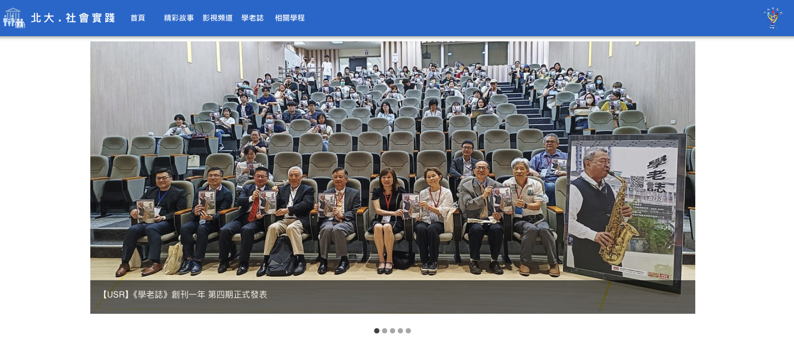
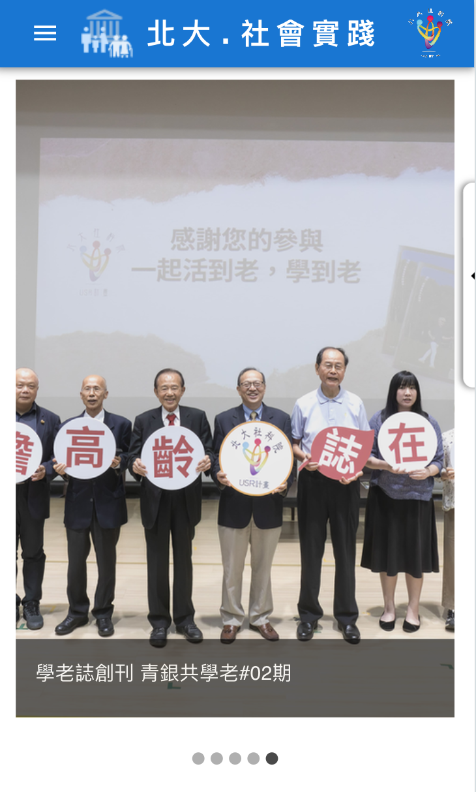
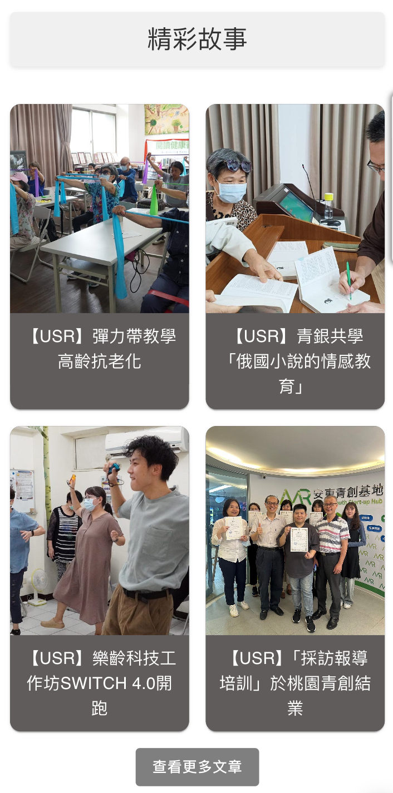
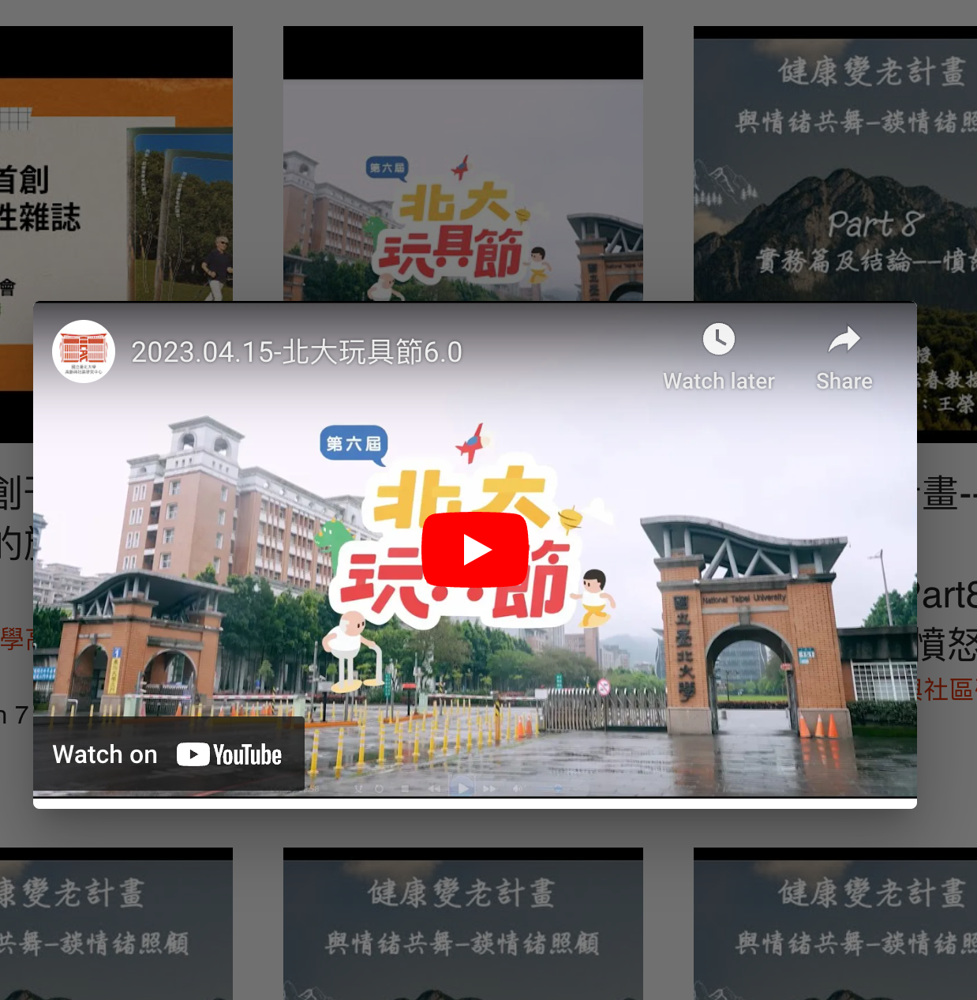
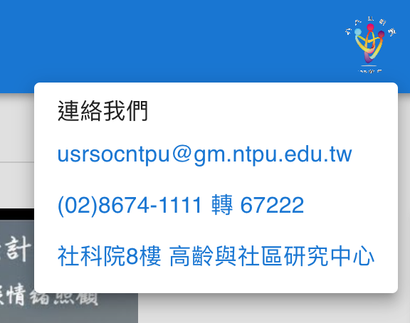

## 創新社會實踐網站：整合數位服務的新典範

在資訊爆炸的時代，如何有效地整合分散於不同平台的資訊，成為一大挑戰。由經濟系林茂廷老師領導的數位服務團隊E.Major，帶領著一群經濟系學生（本次改版主要參與成員：經濟系三年級楊子玄、林士傑及陳敬翰），從社會科學的角度出發，為社會提供理性與感性兼具的數位服務。他們的最新作品——社會實踐網站 （<https://usrsoc.ntpu.edu.tw/>），便是以此為基礎，實現「無為而治，0成本永續經營」的理念，為使用者打造一個方便、統一的資訊入口。

*** 
網站QR code  

新的網站首頁  

*** 

### 設計理念：整合與永續

社會實踐的線上展示目前散佈在四個主要網站平台（medium.com, wix.com, youtube.com, facebook.com）及一個LINE頻道上，各自擁有不同的主題與內容。然而，缺乏一個統一的入口網站，使得使用者在尋找相關資訊時感到困惑與不便。因此，E.Major團隊決定設立一個整合這些資訊的網站，讓使用者可以輕鬆地找到所需的內容。

本次改版的核心理念是「無為而治，0成本永續經營」。各平台的管理者可以繼續按照原有的更新習慣，不需因網站改版而改變。通過使用Google App Scripts定期搜集各平台資訊，並以json格式儲存在Github平台，實現了後台自動化的管理方式。這樣的設計，不僅節省了人力與經費，還能確保網站的長期運營與穩定。

### 特色：先進技術與用戶體驗

新網站採用主流的ReactJS結合Material-UI進行設計，提供卓越的使用者體驗。Material-UI是一套基於Google Material Design規範的前端框架，提供了一系列高質量的UI組件，使得開發者能夠快速構建美觀且一致的使用者介面。我們選擇使用Material-UI，不僅因為它的設計美學，更因為它能夠提升開發效率與使用者體驗。

***
手機呈現

*** 

響應式設計是網站的一大亮點，從桌機到手機，皆能適應各種裝置，確保使用者在任何設備上都能獲得一致且流暢的瀏覽體驗。網站首頁外，還設有四個分頁，分別對應medium.com、youtube.com及wix.com等平台，以及社科院的社會實踐相關學程，方便使用者快速找到所需資訊。

首頁除了展示最新的USR及學老誌文章外，還會隨機抽選三則文章，讓使用者每一次拜訪看到不同的有趣內容。「精彩故事」及「學老誌」分頁則放上USR及學老誌最近的十篇文章，使用者點入後將被引導至原始網站，從而增加原始網站的點閱率。

*** 
最新與隨機三則文章保持新鮮感

精彩故事分頁

*** 

「影視頻道」分頁匯集了USR的YouTube頻道所有影片，使用者可以直接點擊觀看，也可透過播放器連結進入原始YouTube網站頻道。右側邊的抽屜式導覽列，讓使用者可以快速連接到社會實踐的Facebook、LINE、學老誌及YouTube頻道。

***
影視頻道內建播放器 

右側邊的抽屜式導覽列  

***  

此外，右上角的圖示設計亦十分便利，使用者點入後可以直接寄email或撥打電話給高齡社區研究中心，甚至可以通過Google Map找到高齡社區研究中心的位置，提供了多樣化的聯繫方式。

***
更方便的聯繫方式

***

### 結語：數位服務的未來

E.Major團隊以其創新的數位服務理念，成功地將分散的社會實踐資訊整合到一個統一的平台上，不僅提高了資訊的可及性，還實現了0成本的永續經營模式。這一網站不僅是技術與設計的結合，更是對數位服務未來的一次探索與實踐。透過這一網站，我們期待看到更多的社會參與者能夠方便地獲取信息，進一步推動社會實踐的發展與交流。